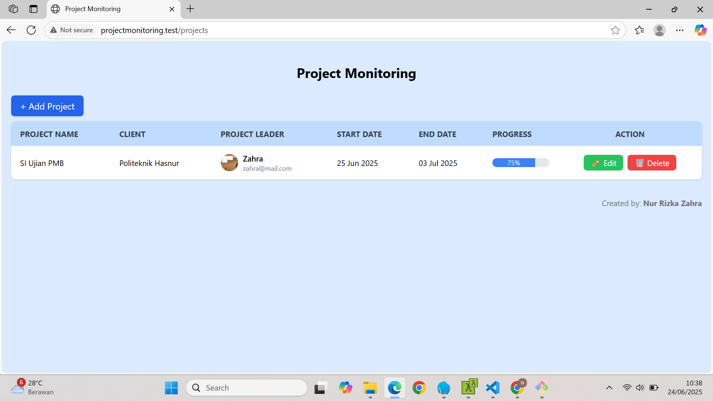
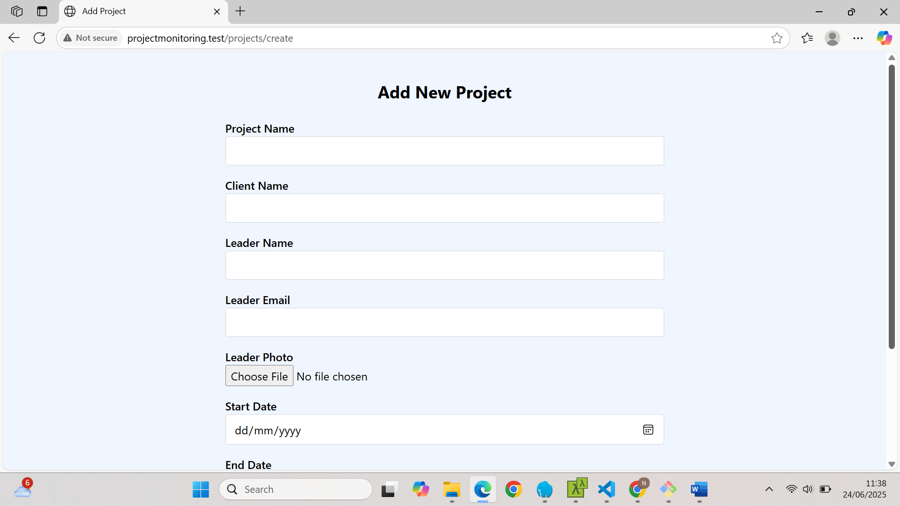
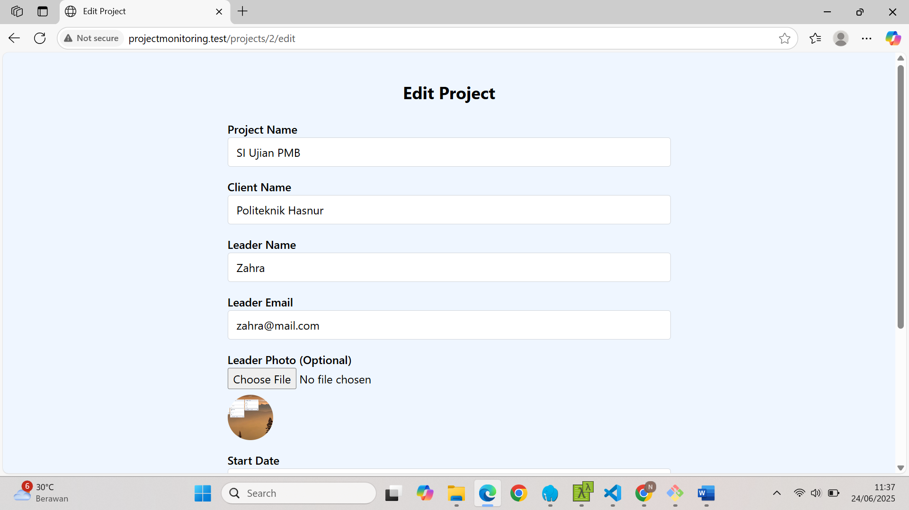

# Sistem Informasi Project Monitoring Sederhana
Website Laravel sederhana yang digunakan untuk mengelola data proyek, seperti judul, project leader, tanggal mulai dan berakhir, nama klien, serta progress dan foto proyek.

## 👩‍💻 Dibuat oleh
**Nur Rizka Zahra**  
D3 Teknik Informatika  
Politeknik Hasnur  

## 📌 Fitur
- Menambahkan data proyek (judul, leader, tanggal, klien, progress)
- Upload foto proyek
- Edit & hapus data proyek
- Tampilan tabel monitoring yang bersih
- Desain menggunakan Tailwind CSS
- Tanpa login (langsung akses)

## 🛠️ Teknologi yang Digunakan
- Laravel 11
- MySQL
- Tailwind CSS
- Laravel File Storage

### 📋 Daftar Project


### ➕ Tambah Project


### ✏️ Edit Project


## 🚀 Cara Menjalankan Project (Lokal)
```bash
git clone https://github.com/NurRizkaZahra/project-monitoring-sederhana.git
cd project-monitoring-sederhana
composer install
cp .env.example .env
php artisan key:generate
php artisan migrate
php artisan serve
